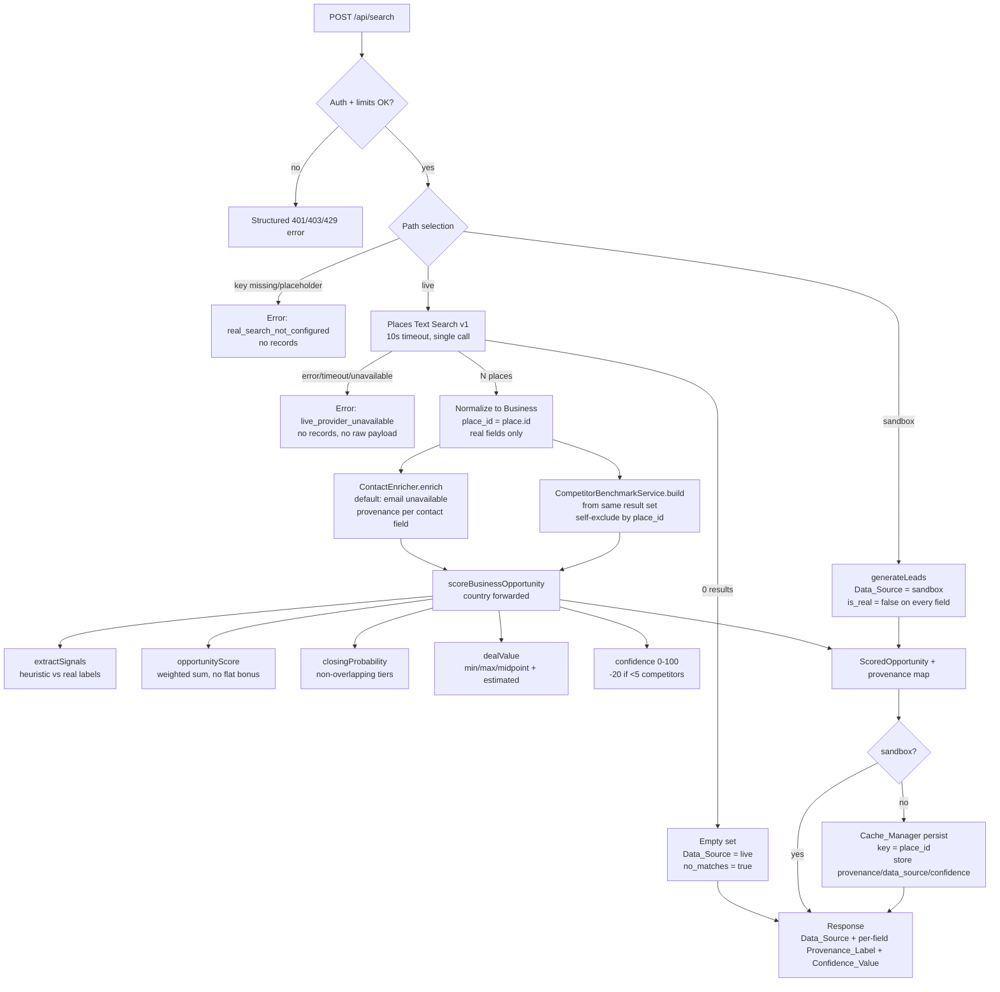

# Design Document — Real Data Intelligence Engine

## Overview

LocalRadar's intelligence pipeline currently interleaves real Google Places data with
fabricated values (guessed emails, hardcoded "competitors", heuristic signals phrased as
verified facts) and ships several scoring defects. This design reworks the pipeline so that
**every value returned to a user is either sourced from real data or explicitly labeled with
its provenance and confidence**, and so that fabricated data can never be presented as fact.

The core idea is a **provenance-threading model**: a small set of honesty primitives
(`Provenance_Label`, `Data_Source`, `Confidence_Value`) is introduced in
`src/types/scoring.ts` and threaded through every layer — `BusinessSignals`,
`ScoredOpportunity`, `Business`, `Opportunity`, and the `/api/search` response. Each
producing component (signal extraction, competitor benchmarking, contact enrichment, deal
value, scoring) stamps the values it emits with a label describing where they came from.

Alongside provenance, this design fixes the concrete calculation bugs called out in the
requirements: double-counted booking bonuses (Req 5), overlapping/contradictory closing
probability tiers with a dead condition (Req 6), inflated deal values stored as the top of the
range (Req 7), mismatched score→audit mapping (Req 8), name-based cache keys that mismatch
same-named businesses (Req 9), a dropped `country` argument that breaks multi-currency (Req 4),
and a silent demo/mock fallback that can return entirely fake results on the live path (Req 10).

This design targets the existing stack unchanged: **Next.js 16.2.9 (App Router route
handlers), React 19, Supabase, TypeScript**. No new runtime frameworks are introduced.

> **Next.js version note (per `AGENTS.md`).** This repository pins `next@16.2.9`, which has
> breaking changes relative to older App Router conventions. Before implementing, consult the
> bundled docs in `node_modules/next/dist/docs/`, in particular
> `01-app/01-getting-started/15-route-handlers.md`. Confirmed conventions relevant here:
> `src/app/api/search/route.ts` is a Route Handler exporting an async `POST(request: Request)`
> using the Web `Request`/`Response` APIs; route handlers are **not** cached for non-`GET`
> methods; and `NextResponse.json(...)` (already used) remains the response helper. The handler
> already reads `request.headers` and `request.json()`, which keeps it request-time/dynamic —
> no change to that behavior is required.

### Goals

- Eliminate pattern-guessed contact emails; label all contact fields with provenance.
- Replace hardcoded mock competitors with a benchmark computed from the real Places result set.
- Label heuristic signals honestly and phrase reasons with assumption language.
- Fix opportunity score, closing probability, and deal value math.
- Correct the score→component→audit mapping so messages match real weaknesses.
- Thread `country` into deal-value formatting on both live and sandbox paths.
- Key cache records on the Places place id, not the business name.
- Remove the silent demo fallback; return honest errors/empty states instead.
- Attach `Data_Source`, per-field `Provenance_Label`, and a `Confidence_Value` to every result.

### Non-Goals

- No foreign-exchange conversion (formatting only — Req 4.5).
- No mandatory live website crawling or paid enrichment provider; the design defines
  extension points (`ContactEnricher`, website-inspection hook) whose **default** behavior is
  honest ("unavailable"/"heuristic"). Real detection can be added later behind those interfaces.
- No UI redesign; this spec covers the engine and API response shape. UI consumes new fields.

## Architecture

### Component map (grounded in real files)

| Component | File | Change |
|---|---|---|
| Search_Engine | `src/app/api/search/route.ts` | Orchestrate honest pipeline; remove guessed emails + silent fallback; place-id cache keys; forward country |
| Provenance primitives | `src/types/scoring.ts` | New `Provenance_Label`, `Data_Source`, `Confidence_Value`, `Provenanced<T>`, field-provenance maps |
| Signal_Extractor | `src/lib/scoring/index.ts` (`extractSignals`) | Emit signal provenance (`heuristic`/`real`/`unavailable`); optional website-inspection hook |
| Opportunity_Scorer | `src/lib/scoring/opportunityScore.ts` | Remove +5/+5 flat bonus; weights sum to 1.00±0.001; documented floors |
| Closing_Probability_Estimator | `src/lib/scoring/closingProbability.ts` | Non-overlapping tier bounds; remove dead `>= 20` clause |
| Deal_Value_Engine | `src/lib/scoring/dealValue.ts` | Forward country; return min/max/midpoint/formatted + `estimated`/`unavailable` label |
| Service_Fit_Calculator | `src/lib/scoring/serviceFit.ts` | Unchanged logic; consumes labeled signals |
| Audit_Generator | `src/lib/scoring/auditGenerator.ts` (new; replaces `generateMockAudit`) | Presence-based messages from correct components; assumption language for heuristic |
| Competitor_Benchmark_Service | `src/lib/scoring/competitorBenchmark.ts` (new) | Build benchmark from live result set; self-exclusion by place id; sample-size labels |
| Contact_Enricher | `src/lib/enrichment/contactEnricher.ts` (new) | Interface + default "unavailable" impl; 10s timeout; never guesses |
| Currency_Formatter | `src/lib/currency.ts` | Case-insensitive country match; default USD |
| Cache_Manager | within `route.ts` + new `src/lib/cache/opportunityCache.ts` helpers | Persist/read keyed by `place_id`; store provenance/data_source/confidence |
| Scoring facade | `src/lib/scoring/index.ts` (`scoreBusinessOpportunity`) | Accept + forward `country`; attach confidence + provenance to `ScoredOpportunity` |
| Types | `src/types/index.ts` | Extend `Business`/`Opportunity` with `place_id`, provenance, deal min/max |

### Data flow

1. **Auth & limits** (unchanged): `getServerUser`, `checkRateLimit`, `checkSearchThrottle`,
   `checkHourlySearchLimit`, `validateUsageAndEntitlement`, `incrementUsage`.
2. **Path selection**:
   - **Sandbox** (`user.is_mock`): `Data_Source = 'sandbox'`, every record flagged non-real,
     `generateLeads` used (the only place mock generation is allowed). Country still forwarded.
   - **Live not configured** (missing/placeholder/invalid key, non-sandbox): structured
     `real_search_not_configured` error. No records.
   - **Live**: call Places Text Search v1 once for the niche+city+country.
3. **Live fetch → normalize**: map each `place` to a `Business` using real fields only
   (`place.id` as `place_id`; website/rating/reviews/phone/address). Contact fields go through
   `ContactEnricher` (default: unavailable). No guessed emails.
4. **Benchmark once per search**: `CompetitorBenchmarkService.build(places)` computes the
   niche+city benchmark from the **same fetched result set**, excluding each scored business by
   place id at scoring time (no extra Places calls).
5. **Score each business**: `scoreBusinessOpportunity(business, benchmarkInput, niche, country)`
   → opportunity score, closing probability, deal value (min/max/midpoint), confidence, and
   per-value provenance.
6. **Audit** (when requested/rendered): `generateAudit(scored)` derives messages from component
   presence and signal provenance.
7. **Persist cache** (non-sandbox live): write `searches`, `businesses` (with `place_id` +
   provenance), `opportunities` (with `deal_value_min/max`, provenance, data_source, confidence),
   associating opportunities to businesses by `place_id`. Reject writes for businesses lacking a
   stable key.
8. **Cache read**: reconstruct associations by `place_id`; skip orphaned opportunities; set
   `Data_Source = 'cache'`; return stored provenance/confidence unchanged.
9. **Respond**: `Data_Source` on the set, per-field provenance and `Confidence_Value` per result.

### Pipeline diagram (provenance threading)



## Components and Interfaces

### 1. Provenance primitives (`src/types/scoring.ts`)

```ts
/** Origin of a single data field. */
export type ProvenanceLabel = 'real' | 'estimated' | 'heuristic' | 'unavailable';

/** Origin of an entire result set. */
export type DataSource = 'live' | 'cache' | 'sandbox';

/** 0-100 integer reliability score. */
export type ConfidenceValue = number; // validated to Number.isInteger && 0..100

/** A value carrying its provenance. `value` is null when label === 'unavailable'. */
export interface Provenanced<T> {
  value: T | null;
  provenance: ProvenanceLabel;
}

/** Per-field provenance for contact information (Req 1, 11). */
export interface ContactProvenance {
  business_email: ProvenanceLabel;
  contact_email: ProvenanceLabel;
  contact_page: ProvenanceLabel;
}

/** Per-signal provenance emitted by the Signal_Extractor (Req 3). */
export type SignalProvenance = Record<SignalKey, ProvenanceLabel>;

export type SignalKey =
  | 'hasWebsite' | 'isInstagramOnly' | 'isFacebookOnly' | 'isOldWebsite'
  | 'noBookingSystem' | 'noLeadForm' | 'noWhatsApp' | 'noAppointment'
  | 'reviewCount' | 'rating' | 'competitorAvgReviews';
```

Design decision — **field-level provenance shape**: rather than wrapping every scalar in
`Provenanced<T>` (which would churn all consumers), we keep the existing scalar fields for
backward compatibility and add sibling **provenance maps** (`ContactProvenance`,
`SignalProvenance`, and label fields such as `dealValueProvenance`). This lets the API attach a
label to each field (Req 11.4/11.7) while minimizing breakage of current UI code.

### 2. Contact_Enricher (`src/lib/enrichment/contactEnricher.ts`) — new

Removes all pattern-guessing. Default implementation never produces an email.

```ts
export interface ContactFields {
  business_email: string;   // '' when unavailable — never a guess
  contact_email: string;    // '' when unavailable
  contact_page: string;     // '' when unavailable
}

export interface EnrichedContact {
  fields: ContactFields;
  provenance: ContactProvenance;
}

export interface ContactEnricher {
  /** Must resolve within timeoutMs; on failure/timeout returns all-unavailable. */
  enrich(input: {
    website: string;
    name: string;
    existing?: Partial<ContactFields>; // preserved, never overwritten by a guess (Req 1.7)
    timeoutMs?: number;                 // default 10_000 (Req 1.7)
  }): Promise<EnrichedContact>;
}

/** DEFAULT: honest no-op. Never guesses. Always 'unavailable' email fields. */
export class NoGuessContactEnricher implements ContactEnricher { /* ... */ }

/** OPTIONAL: wraps an external provider behind the same interface (future).
 *  'real' when the provider confirms association, 'estimated' when located-but-unconfirmed,
 *  'unavailable' on miss/failure/timeout. */
export class ExternalContactEnricher implements ContactEnricher {
  constructor(private provider: EmailLookupProvider, private timeoutMs = 10_000) {}
}
```

Rules mapped to Req 1: no guessing (1.1); label ∈ {real, estimated, unavailable} (1.2);
confirmed → `real` (1.3); located-unconfirmed → `estimated` (1.4); miss → empty + `unavailable`
(1.5); no website → empty + `unavailable` (1.6); failure/10s timeout → empty + `unavailable`,
preserve existing values without overwriting with a guess (1.7). The default `contact_page`
label is `unavailable` unless a real page is confirmed (never `facebook.com/{name}`).

### 3. Competitor_Benchmark_Service (`src/lib/scoring/competitorBenchmark.ts`) — new

Replaces `generateMockCompetitors`. Builds the benchmark from the **live Places result set**
already fetched for the niche+city, so it adds **zero** extra Places API calls/cost.

```ts
export interface PlaceLite {
  placeId: string;
  rating: number;        // 0..5
  reviewsCount: number;  // >= 0
  website: string;
}

export interface CompetitorBenchmarkResult {
  competitorAvgReviews: number | null; // rounded to whole; null when sampleSize === 0
  competitorAvgRating: number | null;  // rounded to 0.1, 0..5; null when sampleSize === 0
  competitorWebsiteRatio: number | null;
  sampleSize: number;                  // count AFTER self-exclusion
  provenance: ProvenanceLabel;         // 'real' (>=3) | 'estimated' (<3 incl. 0)
}

export interface CompetitorBenchmarkService {
  /** Build benchmark for the scored business, excluding it by place id (Req 2.4). */
  build(input: {
    scoredPlaceId: string;
    resultSet: PlaceLite[]; // same niche+city set already fetched (Req 2.1, 2.7)
  }): CompetitorBenchmarkResult;
}
```

Rules mapped to Req 2: derive only from real matching results (2.1); never hardcoded
ratings/counts (2.2); `>=3` competitors → averages + `real` (2.3); exclude self by place id
(2.4); `1..2` → compute from available + `estimated` + record sample size (2.5); `0` → no
benchmark, `estimated`, sampleSize 0, no substituted values (2.6). The service returns
benchmark inputs that `scoreBusinessOpportunity` feeds into the review-gap component (2.7). When
`competitorAvgReviews` is `null` (sample size 0), the review-gap component treats the gap as
unavailable (contributes 0 to score and 0 confidence for that component per Req 11.5) rather
than using the old `180` default.

### 4. Signal_Extractor (`src/lib/scoring/index.ts` → `extractSignals`)

Signature adds an optional website-inspection hook; default behavior labels derived signals as
`heuristic`.

```ts
export interface WebsiteInspection {
  bookingConfirmed?: boolean;
  leadFormConfirmed?: boolean;
  chatConfirmed?: boolean;
  appointmentConfirmed?: boolean;
  ageConfirmed?: boolean;
}

export interface WebsiteInspector {
  inspect(website: string): Promise<WebsiteInspection>; // optional, future 'real' detection
}

export function extractSignals(
  business: Business,
  benchmark: CompetitorBenchmarkResult,
  inspection?: WebsiteInspection, // when absent, booking/leadform/whatsapp/appointment/age are heuristic
): { signals: BusinessSignals; provenance: SignalProvenance };
```

Rules mapped to Req 3: every signal gets a label ∈ {real, heuristic, unavailable} (3.1);
booking/lead-form/whatsapp/appointment/website-age derived from website+phone presence →
`heuristic` (3.2); heuristic reasons use assumption language, no "detected/confirmed/verified/
found" (3.3, 3.4); when a `WebsiteInspection` confirms a feature → `real` + confirmation
language (3.5); Instagram-only/Facebook-only derived only from the website URL value (3.6);
underivable signal → `unavailable`, excluded from confirmed-detection text (3.7).

**Reason phrasing rule (enforced centrally).** A helper `phraseReason(text, label)` guarantees
heuristic reasons read like "Likely no booking system (website not inspected)" and only `real`
signals may use "detected"/"confirmed". This is the single source of truth used by both the
scorer and the Audit_Generator.

### 5. Opportunity_Scorer (`src/lib/scoring/opportunityScore.ts`)

Signature is unchanged; the body is corrected:

```ts
export function calculateOpportunityScore(
  signals: BusinessSignals,
  category?: string,
): { score: number; level: 'High' | 'Medium' | 'Low'; breakdown: OpportunityBreakdown; reasons: string[] };
```

Fixes mapped to Req 5:
- **Remove the additive flat bonus** `if (noBookingSystem) rawScore += 5; if (noLeadForm) rawScore += 5;`.
  Booking signals count exactly once, only through the weighted booking component (5.1, 5.2).
- Pre-clamp score = weighted sum of exactly five components (website, review gap, Google
  presence, booking, activity), each contributing once (5.3).
- Final score is an integer clamped to `[0, 100]` (5.4).
- Category weight sets each sum to `1.00 ± 0.001` (5.5). A unit + property test enforces this
  for every category. (Note: the existing plumber/lawyer/gym/dentist sets already sum to 1.00;
  the design adds an assertion + test so future edits cannot break it.)
- Deterministic: identical signals + normalized category ⇒ identical score (5.6). The scorer
  contains no randomness (the only ID-based variance lives in closing probability and service
  fit, which are out of this component).
- **Floors retained and documented**: `!hasWebsite ⇒ max(55, …)`; instagram/facebook-only ⇒
  `max(45, …)`. These are applied to the weighted sum (not additive stacking) and are documented
  as intentional category-independent minimums.

### 6. Closing_Probability_Estimator (`src/lib/scoring/closingProbability.ts`)

Redesigned tier selection with **non-overlapping** inclusive bounds and no dead condition:

| Tier | Probability bound | Selection rule (mutually exclusive) |
|---|---|---|
| Excellent | 75–85 | `score >= 60 && hasPhone && hasRecentActivity` |
| Good | 55–74 | else if `score >= 60` OR (`score >= 35 && hasPhone`) |
| Average | 35–54 | else if `score >= 35` |
| Weak | 10–34 | else (`score < 35`) |

Fixes mapped to Req 6: exactly one tier per score; final probability inside that tier (6.1);
Weak stays 10–34, never raised into Average (6.2); the four bounds are non-overlapping (6.3);
the dead `|| opportunityScore >= 20` clause is **removed** — the Average branch is reached only
by scores in `[35, 60)` not already claimed by Good (6.4); output ∈ `[0, 100]` (6.5). The
deterministic ±4 id-based variance is applied **before** clamping to the selected tier's bounds,
so variance can never push a probability out of its tier.

```ts
export function calculateClosingProbability(
  opportunityScore: number,
  signals: BusinessSignals,
  businessId?: string,
): number; // integer within the selected tier's inclusive bounds
```

### 7. Deal_Value_Engine (`src/lib/scoring/dealValue.ts`)

```ts
export interface DealValueResult {
  min: number | null;         // >= 0.01, <= 999_999_999.99, <= max; null when unavailable
  max: number | null;
  representative: number | null; // midpoint(min,max) rounded 2dp; strictly < max when min<max
  formatted: string;          // formatted with resolved currency; '' when unavailable
  services: string[];
  provenance: ProvenanceLabel; // 'estimated' when valid; 'unavailable' when no valid range
}

export function calculateDealValue(
  signals: BusinessSignals,
  opportunityScore: number,
  category?: string,
  address?: string,
  businessName?: string,
  country?: string, // forwarded from route.ts (Req 4.1)
): DealValueResult;
```

Fixes mapped to Req 7: produce min & max in `[0.01, 999_999_999.99]` with `min <= max` (7.1);
**representative = round((min+max)/2, 2)**, strictly `< max` whenever `min < max` (7.2); expose
both min and max so the API can return a range (7.3); attach `estimated` (7.4); when a valid
range cannot be produced (e.g. multipliers invert the range or invalid inputs), return
`min/max/representative = null`, `formatted = ''`, `provenance = 'unavailable'`, and the
Search_Engine omits the stored estimate while keeping the rest of the record (7.5). The
Search_Engine stores `representative` as `estimated_deal_value` — **not** `max` as it does today.

Multi-currency (Req 4): `country` is forwarded here and passed to `formatCurrencyRange`. No FX
conversion — only formatting (4.2, 4.5).

### 8. Audit_Generator (`src/lib/scoring/auditGenerator.ts`) — new, replaces `generateMockAudit`

```ts
export function generateAudit(scored: ScoredOpportunity): Audit;
```

Fixes mapped to Req 8: each message derives from the semantically-correct opportunity component
(8.1, 8.2) using **presence/absence of component signals**, not fixed numeric thresholds on
weight-scaled scores (8.4); a business with no website and a social-only presence yields
**no** "outdated/slow website detected" message (8.3); heuristic-labeled signals produce
assumption-phrased messages (8.5); `unavailable` signals produce **no** confirmed-detection
message (8.6). The generator reads the corrected component mapping (below) rather than the old
`opp.website_score >= 20` style thresholds.

### 9. Scoring facade & score→component mapping (`src/lib/scoring/index.ts`)

`scoreBusinessOpportunity` accepts a benchmark result (not a fabricated competitor list) and a
`country`, and returns confidence + provenance:

```ts
export function scoreBusinessOpportunity(
  business: Business,
  benchmark: CompetitorBenchmarkResult,
  categoryInput?: string,
  country?: string,
  inspection?: WebsiteInspection,
): ScoredOpportunity;
```

**Corrected semantic mapping (Req 8.1).** The backward-compatible component scores map to
opportunity components by *meaning*, documented explicitly:

| Legacy field | Opportunity component | Meaning |
|---|---|---|
| `websiteScore` | `websiteOpportunity` | Website weakness/absence |
| `reviewsScore` | `reviewGap` | Review deficit vs benchmark |
| `seoScore` | `gbpWeakness` | Google Business Profile weakness (name kept for compat; documented) |
| `gbpScore` | `revenueLeakage` | Booking/lead-capture leakage |
| `socialScore` | `growthIntent` | Activity/growth intent |

The Audit_Generator consumes these components by meaning, so a social-only business (website
component present, but *no website-detected* signal) never emits a website "detected" message.

**Confidence (Req 11).** Base confidence adjusted by data availability; when a value is
`unavailable`, its contribution to confidence is 0 (11.5). When the competitor benchmark is
based on `< 5` real competitors, confidence is reduced by **at least 20** vs the `>= 5` case,
floored at 0 (11.6, 12.4). Confidence is an integer in `[0, 100]` (11.2).

### 10. Search_Engine (`src/app/api/search/route.ts`)

Path selection (Req 10) replaces the current "demo fallback" block:

```ts
// Pseudocode of the corrected path selection
if (user.is_mock) {
  // sandbox: only place mock generation is allowed
  const mock = generateLeads(niche, city, country); // country forwarded (Req 4.6)
  return json({ success: true, data_source: 'sandbox', is_real_data: false, ...flagAllNonReal(mock) });
}

const apiKey = resolveApiKey(user); // BYOK or env
if (!isUsableKey(apiKey)) {         // missing | 'mock-key' | placeholder | invalid
  return json({ success: false, error_code: 'real_search_not_configured',
                message: 'Real search is not configured.' }, { status: 503 });
}

const places = await fetchPlacesWithTimeout(query, apiKey, 10_000); // Req 10.2 / 12.2
// on error/timeout/unavailable → structured error, NO records, NO raw payload
// on 0 results → empty set, data_source: 'live', no_matches: true (Req 10.4 / 12.1)
```

`isUsableKey` rejects empty, `'mock-key'`, and known placeholder patterns (Req 10.3). On any
Places failure the handler returns `error_code: 'live_provider_unavailable'` identifying the
provider as the failure source **without** the raw provider payload (12.2), and never falls back
to `generateLeads` on the live path (10.1, 10.6). Zero results returns a **success** empty set
with `data_source: 'live'` and a `no_matches: true` indicator distinct from errors (12.1).
Contact-enrichment failure for one business does not fail the search — that business is included
with `unavailable` contact labels (12.3). No secrets, keys, or stack traces appear in any
response (12.5) — the top-level `catch` returns a generic message and logs details server-side.

### 11. Cache_Manager (place-id keyed)

Persist and read keyed by `place_id` (Req 9):

- **Persist**: insert `businesses` with `place_id`; associate each `opportunity` to its business
  by matching `place_id` (not name). If a business has no `place_id` at persist time, reject its
  opportunities from the write and surface a `missing_stable_key` error, leaving prior cache
  unchanged (9.4). Store each result's `provenance` + `data_source` + `confidence` (9.6).
- **Read**: reconstruct associations by `place_id`, reproducing persist-time associations (9.3);
  skip any cached opportunity whose stored `place_id` matches no known business and record an
  `orphaned_skipped` indication (9.5); return stored provenance/data_source/confidence unchanged
  (9.7); set the returned `Data_Source = 'cache'` (9.8).

Same-named businesses (chain locations) never cross-associate because `place_id` is unique per
location (9.1, 9.2).

## Data Models

### Updated TypeScript types (`src/types/index.ts`)

```ts
export interface Business {
  id: string;
  created_at: string;
  search_id?: string;
  organization_id: string;
  place_id: string;              // NEW — stable unique key from Places (Req 9)
  name: string;
  website: string;
  rating: number;
  reviews_count: number;
  phone: string;
  address: string;
  business_email?: string;       // '' when unavailable — never guessed
  contact_email?: string;
  contact_page?: string;
  contact_provenance?: ContactProvenance; // NEW — per-field labels (Req 1, 11)
}

export interface Opportunity {
  id: string;
  created_at: string;
  business_id: string;
  place_id: string;              // NEW — association key (Req 9)
  website_score: number;
  reviews_score: number;
  seo_score: number;
  gbp_score: number;
  social_score: number;
  total_score: number;
  opportunity_level: 'High' | 'Medium' | 'Low';
  estimated_deal_value: number | null; // NEW: midpoint; null when unavailable (Req 7.2, 7.5)
  deal_value_min: number | null;        // NEW (Req 7.3)
  deal_value_max: number | null;        // NEW (Req 7.3)
  deal_value_provenance: ProvenanceLabel; // NEW: 'estimated' | 'unavailable' (Req 7.4)
  closing_probability: number;
  confidence: ConfidenceValue;   // NEW (Req 11.2)
  data_source: DataSource;       // NEW (Req 9.6, 11)
}
```

`ScoredOpportunity` (`src/types/scoring.ts`) gains: `dealValue: DealValueResult` (now with
min/max/representative/provenance), `confidenceScore: ConfidenceValue`, `signalProvenance:
SignalProvenance`, `contactProvenance?: ContactProvenance`, and
`competitorBenchmark.provenance` + `competitorBenchmark.sampleSize`. `BusinessSignals` keeps its
scalar fields; the sibling `SignalProvenance` map carries labels.

### Supabase migration plan (design guidance)

```sql
-- Migration: real_data_intelligence_engine
-- Businesses: add stable place id + contact provenance
ALTER TABLE businesses ADD COLUMN IF NOT EXISTS place_id text;
ALTER TABLE businesses ADD COLUMN IF NOT EXISTS contact_provenance jsonb;
-- Backfill note: legacy rows without place_id remain readable but are treated as orphaned
-- on read (Req 9.5) and cannot be re-associated; a one-time cleanup is recommended.
CREATE INDEX IF NOT EXISTS idx_businesses_place_id ON businesses (place_id);
CREATE UNIQUE INDEX IF NOT EXISTS uq_businesses_search_place
  ON businesses (search_id, place_id) WHERE place_id IS NOT NULL;

-- Opportunities: add association key, deal range, provenance, confidence, data source
ALTER TABLE opportunities ADD COLUMN IF NOT EXISTS place_id text;
ALTER TABLE opportunities ADD COLUMN IF NOT EXISTS deal_value_min numeric(12,2);
ALTER TABLE opportunities ADD COLUMN IF NOT EXISTS deal_value_max numeric(12,2);
ALTER TABLE opportunities ADD COLUMN IF NOT EXISTS deal_value_provenance text
  DEFAULT 'estimated';
ALTER TABLE opportunities ADD COLUMN IF NOT EXISTS confidence smallint;
ALTER TABLE opportunities ADD COLUMN IF NOT EXISTS data_source text;
-- estimated_deal_value stays but now stores the midpoint (nullable for unavailable)
ALTER TABLE opportunities ALTER COLUMN estimated_deal_value DROP NOT NULL;
CREATE INDEX IF NOT EXISTS idx_opportunities_place_id ON opportunities (place_id);

-- Optional CHECK constraints documenting invariants (enforced in app + DB)
ALTER TABLE opportunities ADD CONSTRAINT chk_conf_range
  CHECK (confidence IS NULL OR (confidence BETWEEN 0 AND 100));
ALTER TABLE opportunities ADD CONSTRAINT chk_deal_range
  CHECK (deal_value_min IS NULL OR deal_value_max IS NULL OR deal_value_min <= deal_value_max);
```

The cache read/write in `route.ts` (and the extracted helpers in
`src/lib/cache/opportunityCache.ts`) select these columns and map them onto the interfaces
above. The cached-result mapping sets `data_source: 'cache'` on read (9.8).

### Property-based testing applicability and reduction

Property-based testing **is** appropriate here: the scoring engine, currency formatter,
competitor benchmark, contact enricher, and cache association logic are pure functions (or can
be tested as pure functions with in-memory models) with large input spaces and clear universal
properties. The route handler's provider/wiring behavior (mocked `fetch`, cache `data_source`
tagging) is covered by example/integration tests, not PBT.

The properties below were derived from the prework analysis and then reduced for redundancy:
the five-component score composition (5.1/5.2/5.3) collapses into one model-based property; the
closing-probability tier bounds (6.1/6.2/6.3/6.5) collapse into one membership property; deal
value validity (7.1/7.3/7.4) collapses into one property distinct from the midpoint property
(7.2); and the cache association + label round-trip (9.1/9.2/9.3/9.6/9.7) collapses into one
property.

## Correctness Properties

*A property is a characteristic or behavior that should hold true across all valid executions
of a system — essentially, a formal statement about what the system should do. Properties serve
as the bridge between human-readable specifications and machine-verifiable correctness
guarantees.*

### Property 1: Default contact enricher never guesses and always labels

*For any* business (any name, any website value, including empty), the default
`NoGuessContactEnricher` produces `business_email`, `contact_email`, and `contact_page` that are
never equal to a domain- or name-derived guess pattern, and it assigns each contact field
exactly one `ProvenanceLabel` from `{real, estimated, unavailable}`; when the email cannot be
verified (the default case, and whenever the business has no website), the field is empty with
label `unavailable`.

**Validates: Requirements 1.1, 1.2, 1.5, 1.6**

### Property 2: External enricher label mapping is honest

*For any* stubbed lookup outcome, the `ExternalContactEnricher` labels a confirmed-associated
email `real`, a located-but-unconfirmed email `estimated`, and a miss/failure `unavailable`,
and never emits a guessed value for any outcome.

**Validates: Requirements 1.3, 1.4**

### Property 3: Competitor benchmark is computed, never hardcoded, and self-excluding

*For any* set of real Places results for a niche+city, the `CompetitorBenchmarkService` excludes
the scored business by place id and computes `competitorAvgReviews` (rounded to whole) and
`competitorAvgRating` (rounded to 0.1, within 0.0–5.0) as the arithmetic mean of the remaining
competitors — equal to the manually computed mean and never a fixed constant. When the post-
exclusion sample size is ≥ 3 the provenance is `real`; when it is 1–2 the provenance is
`estimated` with the recorded sample size; when it is 0 the averages are null with provenance
`estimated` and sample size 0.

**Validates: Requirements 2.1, 2.2, 2.3, 2.4, 2.5, 2.6, 2.7**

### Property 4: Signals are exhaustively and honestly labeled

*For any* business, `extractSignals` assigns every emitted signal exactly one `ProvenanceLabel`
from `{real, heuristic, unavailable}`; when no `WebsiteInspection` is supplied, the booking,
lead-form, WhatsApp, appointment, and website-age signals are labeled `heuristic`; and the
Instagram-only and Facebook-only flags are determined solely by the website URL value.

**Validates: Requirements 3.1, 3.2, 3.6**

### Property 5: Reason phrasing matches provenance

*For any* business, every reason string associated with a `heuristic` signal uses
assumption-indicating language (e.g. "likely", "may", "possibly", "not verified") and contains
none of the confirmation terms "detected", "confirmed", "verified", or "found"; and when a
`WebsiteInspection` confirms a feature, the corresponding signal is labeled `real` and its
reason may use confirmation language.

**Validates: Requirements 3.3, 3.4, 3.5**

### Property 6: Opportunity score is the clamped weighted sum with no flat booking bonus

*For any* signals and category, the final opportunity score equals the reference model —
the sum of exactly five weighted components (website, review gap, Google presence, booking,
activity) with the documented floors applied and **no** additive flat bonus for
`noBookingSystem`/`noLeadForm` — rounded to an integer and clamped to `[0, 100]`.

**Validates: Requirements 5.1, 5.2, 5.3, 5.4**

### Property 7: Category weights sum to one

*For any* supported category, the five category weights sum to `1.00` within a tolerance of
`±0.001`.

**Validates: Requirements 5.5**

### Property 8: Opportunity score is deterministic

*For any* signals and category, evaluating the opportunity score twice yields identical results.

**Validates: Requirements 5.6**

### Property 9: Closing probability falls in exactly one non-overlapping tier

*For any* opportunity score in `[0, 100]` and any signals, the produced closing probability is
an integer in `[0, 100]` that lies within the inclusive bounds of exactly one tier — Excellent
`75–85`, Good `55–74`, Average `35–54`, Weak `10–34` — matching the tier selected by the
documented mutually-exclusive rules, and a Weak-tier classification is never raised into the
Average range or higher.

**Validates: Requirements 6.1, 6.2, 6.3, 6.5**

### Property 10: Deal value produces a valid, estimated range

*For any* signals, category, and inputs that yield a valid range, the deal value output has
`min` and `max` with `0.01 ≤ min ≤ max ≤ 999,999,999.99`, exposes both `min` and `max`, and
carries provenance `estimated`.

**Validates: Requirements 7.1, 7.3, 7.4**

### Property 11: Stored deal value is the midpoint below the maximum

*For any* valid produced range, the representative (stored) deal value equals
`round((min + max) / 2, 2)` and is strictly less than `max` whenever `min < max`.

**Validates: Requirements 7.2**

### Property 12: Multi-currency formats without conversion

*For any* numeric `min`/`max` and any country, `formatCurrencyRange` formats both endpoints and
preserves the underlying numeric magnitudes (no FX conversion — the digit sequences of the
amounts are unchanged); supported countries resolve to their own currency by case-insensitive
comparison, and empty/null/unsupported countries resolve to USD.

**Validates: Requirements 4.2, 4.3, 4.4, 4.5**

### Property 13: Backward-compatible scores map to their semantic components

*For any* scored opportunity, `websiteScore` equals the Website Opportunity component score,
`reviewsScore` the Review Gap score, `seoScore` the Google Business Weakness score, `gbpScore`
the Revenue Leakage score, and `socialScore` the Growth Intent score.

**Validates: Requirements 8.1**

### Property 14: Audit messages are presence-derived from the correct component and honestly phrased

*For any* scored opportunity, each audit message appears only when its semantically
corresponding component has present signals (not from fixed thresholds on weight-scaled scores);
a business with no website and a social-only presence produces no "outdated/slow website
detected" message; messages derived from `heuristic` signals use assumption language; and no
confirmed-detection message is derived from an `unavailable` signal.

**Validates: Requirements 8.2, 8.3, 8.4, 8.5, 8.6**

### Property 15: Cache association and honesty labels round-trip by place id

*For any* collection of businesses (including businesses that share a name but have distinct
place ids) and their opportunities, persisting then reading through the cache model reconstructs
the exact same business-to-opportunity associations by matching place id — with zero
cross-association between same-named businesses — and returns the same `ProvenanceLabel` and
`Data_Source` values that were stored.

**Validates: Requirements 9.1, 9.2, 9.3, 9.6, 9.7**

### Property 16: API key usability classification

*For any* API key string, `isUsableKey` returns false for empty, `'mock-key'`, and placeholder
values, and true only for a plausibly valid configured key.

**Validates: Requirements 10.3**

### Property 17: Sandbox results are fully flagged non-real

*For any* sandbox search, the result set has `Data_Source = 'sandbox'`, every returned record is
flagged non-real, and a non-real-data indicator is present.

**Validates: Requirements 10.5, 10.7**

### Property 18: Confidence is a bounded integer with honest contributions

*For any* scored opportunity, the `Confidence_Value` is an integer in `[0, 100]`; a value
labeled `unavailable` contributes 0 to confidence; and a benchmark based on fewer than 5 real
competitors yields a confidence at least 20 points lower than the same opportunity scored with a
benchmark of 5 or more competitors, never falling below 0.

**Validates: Requirements 11.2, 11.5, 11.6, 12.4**

### Property 19: Error responses never leak secrets

*For any* triggered failure (provider error, missing key, enrichment failure, internal error),
the response body contains no configured API key value, no environment-variable dump, and no raw
stack trace.

**Validates: Requirements 12.5**

## Error Handling

All error responses use `NextResponse.json(...)` with a structured shape and a stable
`error_code`, and **never** include secrets, raw provider payloads, or stack traces (Req 12.5).
Details are logged server-side only.

| Condition | Path | Response | Requirements |
|---|---|---|---|
| Unauthorized | any | `401 { success:false, error_code:'unauthorized' }` | existing |
| Rate/throttle/hourly exceeded | any | `429` with existing messages | existing |
| Usage/entitlement blocked | any | `403 { reason }` | existing |
| Real search not configured (missing/placeholder/invalid key, non-sandbox) | live | `503 { success:false, error_code:'real_search_not_configured', message:'Real search is not configured.' }` | 10.3 |
| Places error / non-OK / timeout (10s) / unavailable | live | `502/504 { success:false, error_code:'live_provider_unavailable', message:'Live results could not be retrieved from the data provider.' }` (no raw payload, no records) | 10.2, 12.2 |
| Zero matching businesses | live | `200 { success:true, data_source:'live', businesses:[], opportunities:{}, no_matches:true }` | 10.4, 12.1 |
| Contact enrichment failure (per business) | live | business included; its contact fields empty + `unavailable`; search does not fail | 12.3 |
| Competitor benchmark failure/estimated | scoring | scoring completes with `estimated` benchmark, reduced confidence, `reduced_confidence:true` indicator | 12.4 |
| Missing stable key at persist | cache write | reject that business's opportunities; surface `missing_stable_key`; prior cache unchanged | 9.4 |
| Orphaned cached opportunity at read | cache read | exclude it; record `orphaned_skipped` indication | 9.5 |
| Unexpected internal error | any | `500 { success:false, message:'Internal server error.' }` (generic; details logged) | 12.5 |

**Timeout implementation.** The Places call uses `AbortController` with a 10s timeout so that a
hung provider produces `live_provider_unavailable` rather than hanging the request (10.2, 12.2).
The contact enricher uses its own 10s timeout and fails to `unavailable` (1.7, 12.3).

## Testing Strategy

**Tooling.** The repo currently has no test runner. Add **Vitest** (fast, native ESM/TS, works
with Next 16 + React 19) and **fast-check** for property-based testing, plus a `test` script.
These are dev-only and do not affect the app runtime. Property tests import the pure scoring/
currency/enricher/benchmark modules directly; route-handler behavior is tested by mocking
`fetch` and the Supabase client.

**Dual approach.**
- **Unit / example tests** cover concrete scenarios and wiring: country forwarded on live and
  sandbox paths (4.1, 4.6); cache hit sets `data_source:'cache'` (9.8); zero-results empty set
  distinct from errors (12.1); provider failure omits payload and names the provider (12.2);
  enrichment failure keeps the business with unavailable labels (12.3); no dead `>= 20` clause —
  scores 20–34 yield Weak not Average (6.4); live path returns only real place-id-bearing
  records (10.1, 10.6); provider error yields no records (10.2); zero results stays `live`
  (10.4).
- **Property tests** cover the 19 universal properties above.

**Edge cases** (covered via generators or targeted tests): enricher timeout/failure preserving
existing values (1.7); benchmark sample size 0 (2.6); underivable signal `unavailable` (3.7);
invalid deal-value range → `unavailable`, record intact (7.5); missing stable key rejected
(9.4); orphaned cached opportunity skipped (9.5).

**Property test configuration.**
- Property-based testing uses **fast-check** — do not hand-roll a generator/shrinker framework.
- Each property test runs a **minimum of 100 iterations** (`{ numRuns: 100 }` or higher).
- Each property test is tagged with a comment referencing its design property, in the format:
  `// Feature: real-data-intelligence-engine, Property {number}: {property_text}`.
- Each of the 19 correctness properties is implemented by a **single** property-based test.

**Determinism note.** Reference-model properties (Property 6, Property 15) reimplement the
expected computation independently of production code, so a regression in either implementation
surfaces as a mismatch. Property 12 asserts magnitude preservation by comparing the digit runs
of the input amounts against the formatted output rather than parsing locale-specific separators.

**Verification before completion.** After implementation, run `npm run typecheck`,
`npm run lint`, `npm run build`, and the new `npm test` (Vitest single-run) and fix any failures
before considering tasks done. Per `AGENTS.md`, re-check `node_modules/next/dist/docs/` for any
route-handler breaking changes before editing `src/app/api/search/route.ts`.
